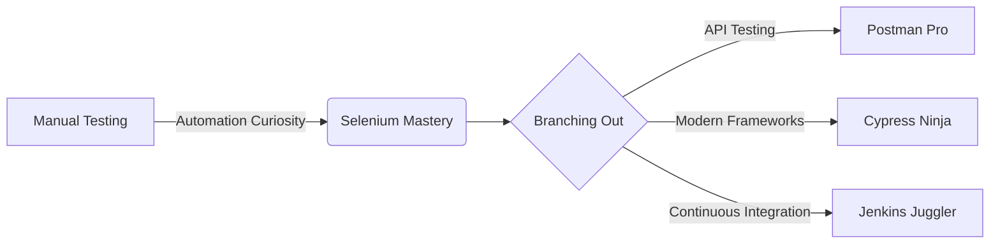

  
## About me
### 
 Hey! I'm Eros a Software QA Engineer from Argentina 🇦🇷 passionate about creating visually appealing projects with excellent software quality 👨‍💻  
 ###   

### Languages and Devtools

 &nbsp;&nbsp;&nbsp;
  &nbsp;&nbsp;&nbsp;
  &nbsp;&nbsp;&nbsp;
  &nbsp;&nbsp;&nbsp;
  &nbsp;&nbsp;&nbsp;
  

</td>
<td valign="top" width="33%" style="border: 1px solid white;">

### QA Automation

  &nbsp;&nbsp;&nbsp;
  &nbsp;&nbsp;&nbsp;
  &nbsp;&nbsp;&nbsp;
  

</td>
<td valign="top" width="33%" style="border: 1px solid white;">

### Testing Tools and CI/CD

  &nbsp;&nbsp;&nbsp;
  &nbsp;&nbsp;&nbsp;
  &nbsp;&nbsp;&nbsp;
  

## Connect with me  

  

  
  
## My Skills 💼

- 🌐 Expertise in web application testing and automation
- 🔍 Sharp eye for detail in UI and functionality testing
- 🚀 Proficiency in CI/CD integration for seamless test execution
- 📊 Data-driven approach to test strategy and reporting
- 🛠️ Custom test framework development

## My QA Journey 🗺️

  

